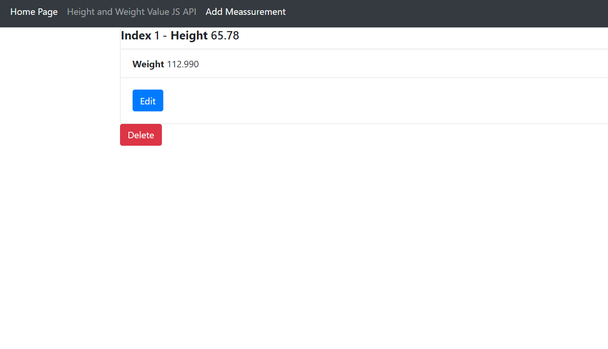

# IS601 - Web App 3
This project is a homework assignment to get Pycharm working with Docker, Flask, and MySQL.

# Running WebApp

# Table in Pycharm

# View Record

# Edit

# Delete (Index 1 deleted)

# IS601 - Web App 4

